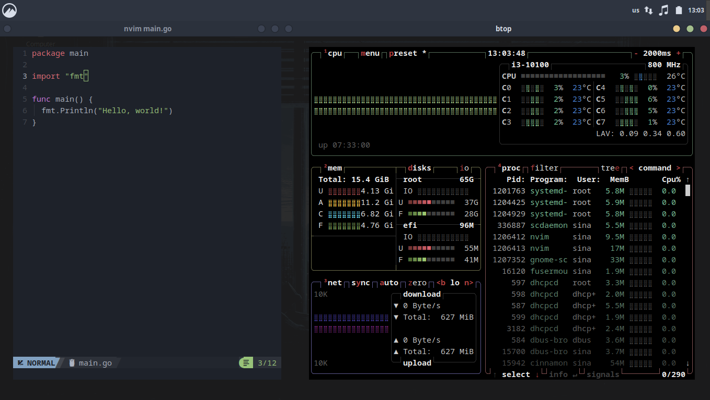

# Sina's Dotfiles (Arch Cinnamon)

This repository contains my personal configuration files for Arch Linux with Cinnamon, ensuring easy management and synchronization across machines.

## Screenshots

**Desktop Environment**  
  
*Nordic theme, BreezeX-Dark cursors, and custom panel layout*

**Neovim Setup**  
  
*Neovim with LSP support, Alacritty terminal, and btop system monitoring*

**VS Code Setup**  
  
*VS Code with Nord theme*

**Vivaldi Setup**  
  
*Vivaldi with custom theme and settings*

## Structure

The repository is structured to include all my dotfiles and configuration directories in its root, mirroring my home directory. This includes:

- Shell configurations (e.g., `.zshrc`, `.bashrc`)
- Editor configurations (e.g., `.vim`, `config/nvim`)
- Application configurations:
  - Alacritty (`config/alacritty`)
  - Vivaldi (`vivaldi`)
  - Visual Studio Code (`vscode`)
- Desktop environment configurations:
  - Cinnamon (`cinnamon/dconf_settings.ini`, `cinnamon/extensions`)
- Custom themes and icons:
  - Nordic theme (`themes/Nordic`)
  - Nordzy icons (`icons/Nordzy`)

## Installation

To set up this repository on your system, follow these steps:

1. **Clone the Repository:**

   ```bash
   git clone https://github.com/sudosz/cinnamon-dotfiles ~/dotfiles
   ```

2. **Install GNU Stow:**

   If you haven't installed GNU Stow yet, you can do so using:

   ```bash
   sudo pacman -S stow
   ```

3. **Create Symlinks:**

   Navigate to the cloned repository and use Stow to create symlinks in your home directory:

   ```bash
   cd ~/dotfiles
   stow -t ~ .
   ```

   This command will create symlinks in your home directory for all files and directories in the repository.

## Customizations

- **Shell:** zsh with custom configurations in `.zshrc`.
- **Desktop Environment:** Cinnamon 6.4.8 with Nordic theme and Nordzy icons.
- **Editor:** Neovim with custom configurations in `config/nvim`.
- **Terminal:** Alacritty.
- **Browser:** Vivaldi.
- **IDE:** Visual Studio Code.

## Notes

- For configurations not directly under your home directory (e.g., `~/.local/share/cinnamon/extensions`), you may need to handle them separately or adjust the repository structure accordingly.
- Ensure to configure any application-specific settings that require additional steps beyond just having the configuration files.

## License

[MIT License](https://opensource.org/licenses/MIT)
